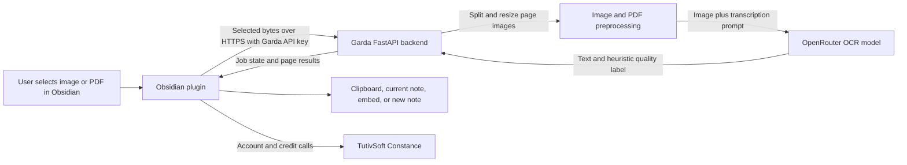

# Garda Handwriting Text OCR -- Software Architecture

Version: 5.7.14

## System boundary

Garda consists of an Obsidian TypeScript plugin and a separately deployed FastAPI OCR backend. The backend keeps OCR processing separate from account and credit management, which is provided by TutivSoft Constance.

## Components

- Obsidian integration: registers command-palette, file-menu, editor-menu, settings, and progress-notice actions.
- OCR client: validates backend configuration, submits selected attachment bytes, polls job state, requests cancellation, and computes the local cache key.
- Vault workflow: routes page text to the clipboard, current Markdown note, selected embed, or a new transcription note; folder batches create a note per source.
- Garda API: authenticates bearer keys, accepts image/PDF jobs, splits PDFs, preprocesses pages, calls the configured OCR model, returns per-page results, and removes expired in-memory jobs.
- OpenRouter: receives preprocessed page images and the transcription prompt from the Garda backend.
- Constance: owns account linking, entitlements, plan checkout, credit balance, and idempotent page-credit spends.

## Data flow

## Processing and state

The plugin only sends an attachment after an explicit action. Single images are normalized to JPEG before OCR. PDFs are rendered page by page; the backend processes those page images in sequence and reports progress and partial failures. The plugin caches completed page results using the source path plus a lightweight content signature. This is an optimization and not a server-side deduplication guarantee.

Backend jobs and uploaded bytes are held in process memory. The retention loop removes finished jobs after the configured period (900 seconds by default). There is no durable job queue, so a service restart can interrupt an active job. The backend does not store uploads on disk in this implementation.

## Quality and editing safeguards

The backend applies simple output heuristics to label a page high, medium, or low quality and request manual review where appropriate. These labels are not model-provided or calibrated confidence scores. The plugin blocks embed replacement when any page needs review. Other destinations remain user-directed; review extracted text before relying on it.

## Billing separation

The plugin links a stable installation identity to Constance, requests the account balance, opens catalog-backed checkout, and uses persisted idempotency events for credit spends. The OCR backend does not implement billing and does not receive the user's Constance account token.

## Release layout

The source repository contains the plugin, backend, tests, and development metadata. The uploadable public plugin snapshot contains the complete TypeScript source tree, generated main.js, manifest, stylesheet, attestation workflow, license, and user-facing documentation. It deliberately excludes the backend, credentials, vault data, and dependency caches.
